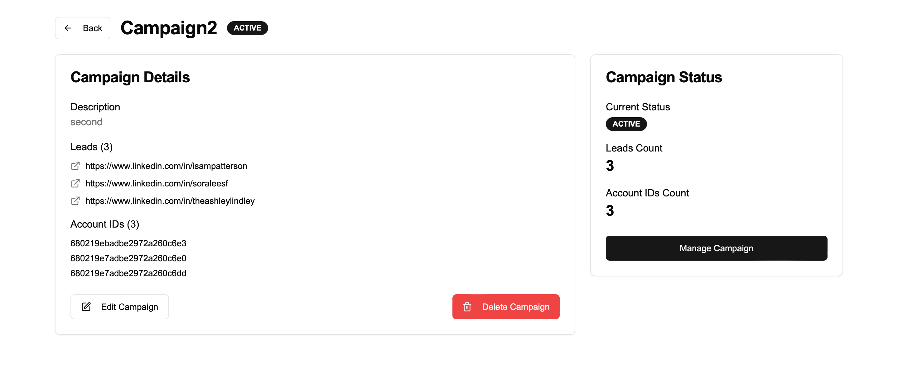

# LinkedIn Campaign Manager

A full-stack application for managing outreach campaigns with LinkedIn profile scraping and personalized message generation.

## Screenshots


*Home Page*


*Campaigns Page*


*Manage Campaign Page*


*Personalised Message Page*

## Features

- **Campaign Management**:
  - Create, read, update, and delete (soft delete) campaigns
  - Track campaign status (ACTIVE/INACTIVE/DELETED)
  - Manage leads and account associations

- **LinkedIn Integration**:
  - Scrape LinkedIn profiles from search URLs
  - Store scraped profile data in MongoDB
  - Generate personalized outreach messages using AI

- **User Interface**:
  - Dashboard for campaign management
  - Forms for creating/editing campaigns
  - LinkedIn profile scraping interface
  - Message generation preview

## Technologies

### Backend
- Node.js + Express + TypeScript
- MongoDB (Mongoose ODM)
- Puppeteer (for LinkedIn scraping)
- RESTful API architecture

### Frontend
- Next.js 15 with App Router
- React 19
- TypeScript
- Tailwind CSS + ShadCN UI components
- React Hook Form + Zod for form validation

## Setup Instructions

### Prerequisites
- Node.js (v18+ recommended)
- MongoDB (local or cloud instance)
- PNPM (for frontend)
- LinkedIn account (for scraping)

### Backend Setup
1. Navigate to the backend directory:
```bash
cd backend
```

2. Install dependencies:
```bash
npm install
```

3. Create a .env file in the backend directory with the following variables:
- MONGODB_URI=mongodb://localhost:27017/campaign_db
- PORT=5000
- LLM_ENDPOINT=https://api.deepinfra.com/v1/openai/chat/completions
- LLM_MODEL=meta-llama/Llama-3.3-70B-Instruct
- OPENAI_API_KEY=your_deepinfra_api_key
- LI_AT=your_linkedin_cookie

4. Run the development server:
```bash
npm run dev
```

### Frontend Setup
1. Navigate to the frontend directory:
```bash
cd frontend
```

2. Install dependencies:
```bash
pnpm install
```

3. Create a .env file in the frontend directory with:
- NEXT_PUBLIC_API_URL=http://localhost:5000

4. Run the development server:
```bash
pnpm run dev
```

## API Endpoints

### Campaign Management

- `GET /campaigns` - Get all active campaigns
- `GET /campaigns/:id` - Get single campaign
- `POST /campaigns` - Create new campaign
- `PUT /campaigns/:id` - Update campaign
- `DELETE /campaigns/:id` - Soft delete campaign

### LinkedIn Integration

- `POST /personalized-message` - Generate outreach message
- `POST /scraper/scrape` - Scrape LinkedIn profiles
- `GET /scraper/profiles` - Get scraped profiles

## Data Models

### Campaign

```typescript
interface ICampaign {
  name: string;
  description: string;
  status: 'ACTIVE' | 'INACTIVE' | 'DELETED';
  leads: string[]; // LinkedIn profile URLs
  accountIDs: string[]; // MongoDB profile IDs
  createdAt: Date;
  updatedAt: Date;
}
```

### Linkedin Profile

```typescript
interface ILinkedInProfile {
  fullName: string;
  jobTitle: string;
  company: string;
  location: string;
  profileUrl: string;
  scrapedAt: Date;
}
```